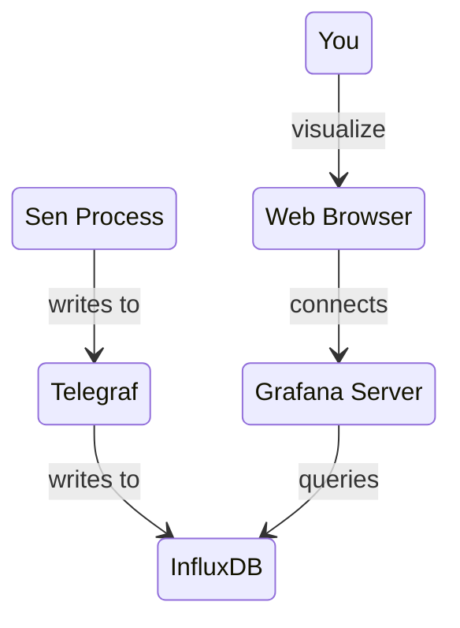

# The Influx Component

{: style="width:120px"}

With Sen, you can use Grafana and InfluxDB to visualize the data that runs through your system.

{: style="width:1200px;"}

It works as follows:

1. Your Sen process sends the data to another process called
   [Telegraf](https://www.influxdata.com/time-series-platform/telegraf/).
2. [Telegraf](https://www.influxdata.com/time-series-platform/telegraf/) sends the data to a
   time-series database called [InfluxDB](https://www.influxdata.com/db/).
3. [InfluxDB](https://www.influxdata.com/db/) is then queried by a process called
   [Grafana](https://www.grafana.com), which is a web server.
4. You connect to the [Grafana](https://www.grafana.com) server using your web browser.



These monitoring and visualization systems (Telegraf, InfluxDB, Grafana) can be combined in many
ways. They are designed to be composable and really scalable. The price to pay is that you have to
set up your InfluxDB server, execute the Telegraf server, ensure that they are connected, and then
connect Grafana to InfluxDB. Hopefully, this is something that only happens once.

The configuration and usage of these 3rd-party tools are out of the scope of this document, but
thankfully there is plenty of information available on the web, and a large community of open-source
and commercial users.

Once the data is stored in InfluxDB, you can access it anytime. Maybe you can find other uses, and
connect other tools to do your analytics.

The Sen `influx` component sends the data to Telegraf over UDP or TCP.

## Running the Influx component

The configuration parameters are:

```rust title="Influx configuration options"
--8<-- "snippets/influx_config.stl"
```

For example, you can run a Sen process and tell the `influx` component to forward all the objects in
a given bus:

```yaml title="Example hello_influx.yaml"
load:
  - name: influx
    group: 3
    protocol: tcp
    telegrafAddress: 127.0.0.1
    telegrafPort: 8095
    batchSize: 32
    selections:
      - SELECT * FROM school.primary
```

## Data model

In InfluxDB, each data point contains the following elements:

- **measurement**: String that identifies the measurement to store the data in.

- **tag set**: Comma-delimited list of key value pairs, each representing a tag.

- **field set**: Comma-delimited list key value pairs, each representing a field.

- **timestamp**: Unix timestamp associated with the data in nanosecond precision.

They use a "line protocol" that represents a data point in the following format:

```
measurement,tag1=val1,tag2=val2 field1="v1",field2=1i 0000000000000000000
```

## Mapping from objects to time series

Sen applies the following translation between its object's model and Influx's protocol:

- All data points have a tag named `object` containing the name of the object.

- All data points have a tag named `payload_type` containing the type of information contained.
  Possible values are: `event`, `property_change`, `creation` and `deletion`.

- For property changes, the measurement is the name of the property. The value stored in the `value`
  field.

- For events, the measurement is the name of the event. The arguments (if any) are added as fields.

- For creations, the measurement is "created". All property values are added as fields.

- For deletions, the measurement is "deleted". There are no fields.

- When dealing with values of structures, the information is flattened by creating an Influx field
  per structure field. This happens recursively, using dots as separators.

- When dealing with values of variants, the `type` field will contain the name of the type held by
  it. The `value` field will contain the corresponding value.

- When dealing with enumerations, there will be an extra ".key" field indicating the numeric value.

## Grafana, InfluxDB, and Telegraf Docker Deployment Guide

There is a docker image which start a **Grafana** web server and all the components needed to
receive and serve the data.
