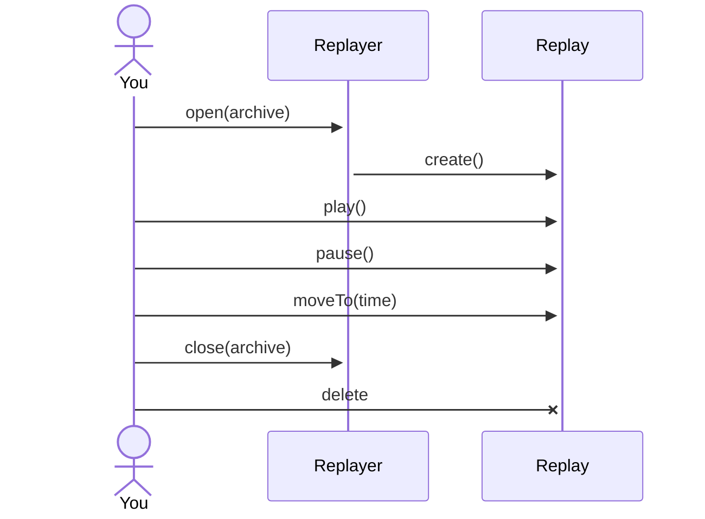

# Replaying

{: style="width:300px; float: right;"}
{: style="width:300px; float: right;"}

If you have a Sen archive, you can play it back using the `replayer` component.

There are two ways of starting a replay. The simplest one is to do:

```
# load the archive and start the playback straight away
$ sen replay my_archive

# load the archive but keep the replay stopped
$ sen replay my_archive --stopped
```

You can see that this approach creates the replay in an independent process. While convenient,
sometimes you might want to do embed replay in your own process. For example, in testing or during
development.

This can be done by adding the `replayer` component to your configuration file. For example:

```yaml title="Adding the replayer to your process"
  - name: replayer
    autoOpen: school_recording  # this is the path to the archive
    autoPlay: true  # start the playback right away
    group: 20
```

The configuration options are defined in the component's STL:

```rust title="Replayer configuration options"
--8<-- "snippets/replayer_config.stl"
```

The main object of the `replayer` component is the `Replayer` object. It allows you to open multiple
archives for replay. Every time you open an archive, a `Replay` object is created, which is the one
you can use to control the playback.

The interface for these objects is this:

```rust title="Replayer interface"
--8<-- "snippets/replayer.stl"
```

The typical usage would be something like this:


