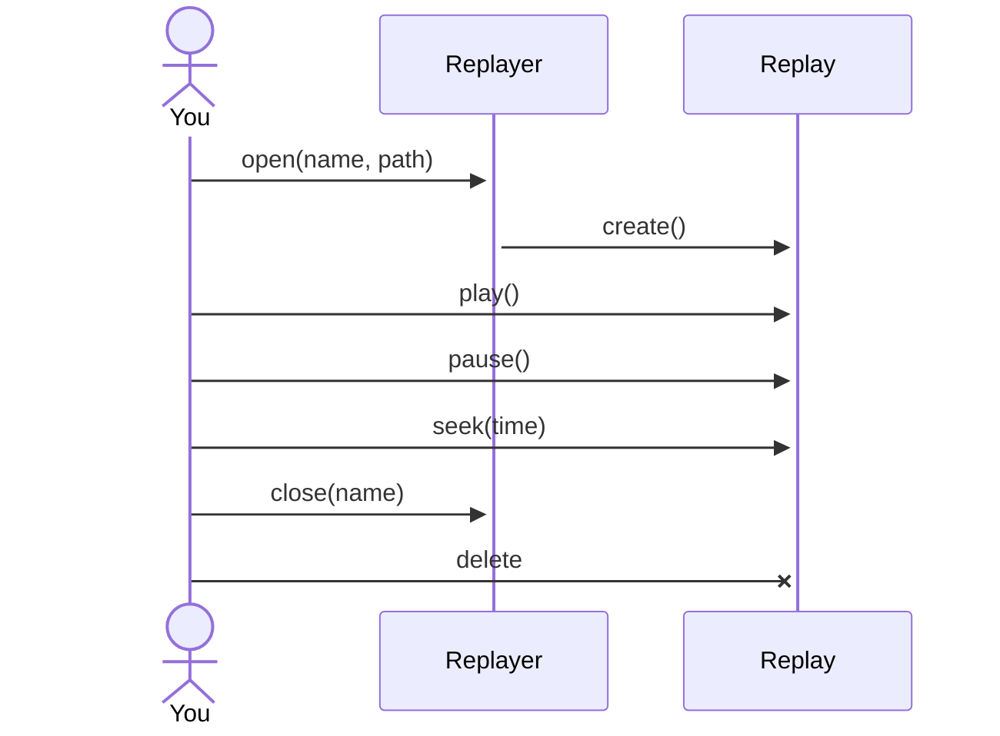

# Replaying

{: style="width:300px; float: right;"}
{: style="width:300px; float: right;"}

If you have a Sen archive, you can play it back using the `replayer` component.

## Starting a replay

The simplest way to start a replay is:

```shell
# load the archive and start the playback straight away
$ sen replay my_archive

# load the archive but keep the replay stopped
$ sen replay my_archive --stopped
```

You can see that this approach creates the replay in an independent process. While convenient,
sometimes you might want to embed a replay in your own process. For example, in testing or during
development.

This can be done by adding the `replayer` component to your configuration file. For example:

```yaml title="Adding the replayer to your process"
load:
  - name: replayer
    autoOpen: school_recording  # this is the path to the archive
    autoPlay: true  # start the playback right away
    group: 20
```

The configuration options are defined in the component's STL:

```rust title="Replayer configuration options"
--8<-- "snippets/replayer_config.stl"
```

## The Replayer object

The main object of the `replayer` component is the `Replayer` object. It allows you to open multiple
archives for replay. Every time you open an archive, a `Replay` object is created, which is the one
you can use to control the playback.

The interface for these objects is this:

```rust title="Replayer interface"
--8<-- "snippets/replayer.stl"
```

The typical usage would be something like this:


```mermaid
sequenceDiagram
    actor You
    You->>+Replayer: open(name, path)
    Replayer->>+Replay: create()
    You->>+Replay: play()

    You->>+Replay: pause()
    You->>+Replay: seek(time)
    You->>+Replayer: close(name)
    You-xReplay: delete
```

## What a replay reproduces

A replay reproduces what was recorded, which is state and events. Nothing is re-executed: method
calls were never in the archive, so components that called each other during the original run do not
do so again.

Playback advances by the replayer's own cycle. Each update takes the time elapsed since the last one
and applies every entry whose recorded timestamp falls in that window, so recorded timing is
reproduced to the resolution of one cycle, and entries closer together than that arrive together.
Because the step comes from the execution time, a replay follows the kernel's run mode: real time,
or a virtual clock you drive as slowly or as quickly as you like.

Seeking is exact in time rather than keyframe-granular. The replayer jumps to the keyframe at or
before the time you asked for and then replays forward to it, so the keyframe period decides what a
seek costs rather than how precisely it lands. An archive recorded without keyframes does not
support seeking, and says so.
