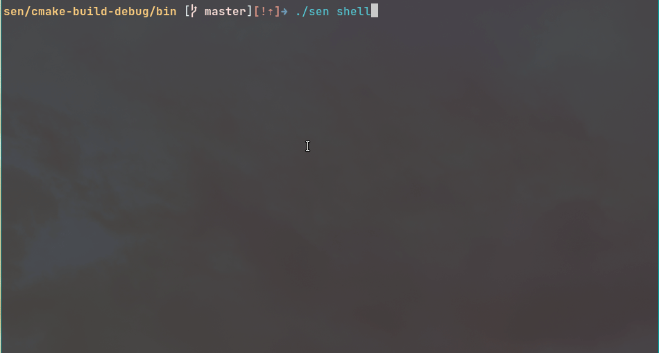
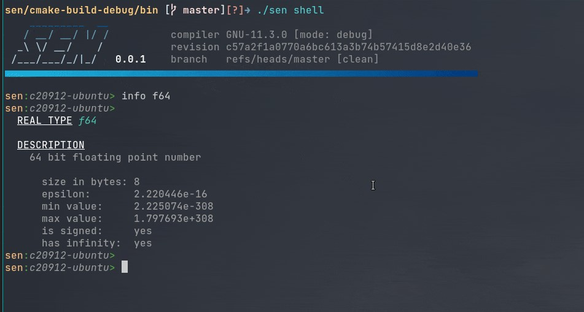
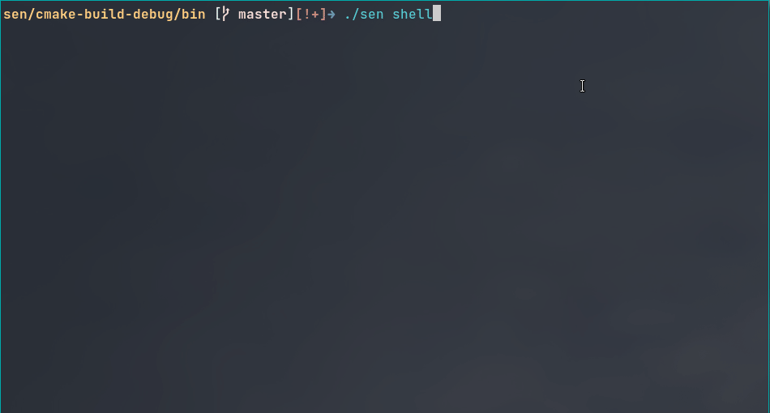

{: style="width:150px; float: right;"}
{: style="width:150px; float: right;"}

# The Sen Shell

## Getting it started

The Sen shell allows you to interact with all the objects that are published to the buses in the
kernel.

It makes use of the extensive introspection capabilities that are built-in into Sen. That's why you
get auto-complete, error-checking, argument parsing and even the ability to read the documentation.

You can run a stand-alone shell by typing:

```shell
$ sen shell
```

And you can load the shell component into any kernel. You do it like this:

```yaml
load:
  - name: shell
    group: 2     # you decide when to start the shell
```

Once you start the shell, you can use tab to auto-complete and/or see the available commands. If you
type `help` to you will see more info about all the options you have.

{: style="width:900px"}

To shut down the shell, you simply type Ctrl+D or the `shutdown` command.

## Opening and closing buses

The `ls` command is specially useful because it allows you to see all the objects that are visible
by the shell.

The shell does not see any objects by default. The only thing you can see are the available
sessions. You need to open sessions and their buses so that the shell can start discovering objects.

The `open` command can be used to connect to a bus or to open a session and discover the available
buses. This command has auto-complete capabilities to help you. Let's give it a try.

{: style="width:900px"}

You can see that the shell lets you know about when objects are discovered. The 'ls' command shows
them. Unsurprisingly, the `close` command does the inverse.

Sometimes you will find yourself having to open some buses every time you load the shell. This is
because you are interested in working with some objects and the shell is not opening any bus by
default. To change this, you can set the `open` parameter in your configuration file and the shell
will automatically open them at the start:

```yaml
load:
  - name: shell
    group: 2
    open: [ local.kernel ]  # automatically open the 'local.kernel' bus
```

## Calling methods on objects

The Shell allows you to invoke methods on objects, no matter if they are local or remote. For
example, this shows how to call the `addNumbers` method on an object.

{: style="width:1200px"}

Keep in mind that due to Sen's asynchronous nature, the shell won't block and the call results will
eventually arrive.

## Introspecting the system

You can use the shell to get information about the system. For example, you can use the kernel
object to find out the available types, units and the build information of the kernel and all
components.

And there's also a method named `info`, that you can use to inspect all the details of the available
types (the built-in types, and also any type received over the network during execution).

{: style="width:1200px"}

## Creating Queries

When you `open` a bus, you are declaring an interest in all the objects that are published in it.
You can inspect the list of active interests by using the `src` command. For example, if we call
`open local.kernel` and then call `src` we will see the following:

```
  Name               Query                      
  local.kernel.all   SELECT * FROM local.kernel
```

This means that we have an active query named "local.kernel.all" which defines an interest in all
objects of that bus.

You can create your own queries, and therefore use the shell to monitor certain objects. For
example, lets create a query that ony notifies us about the entities in the se.env bus, with a force
ID property that is "neutral" or "friendly". We call that query "friendly_fire":

{: style="width:1200px;"}

You can now see that the shell automatically opened the se.env bus and created a query named
se.env.friendly_fire.

To close/delete a query, use te `close` command and pass the name of the query.

If you want the shell to automatically open some predefined queries, do as follows:

```yaml title="Configuring the shell to auto open queries"
load:
  - name: shell
    query:
      - name: lat_in_range
        selection: "SELECT rpr.PhysicalEntity FROM se.env WHERE spatial.SpatialFPStruct.worldLocation.x BETWEEN 0.0 AND 500.0"
      - name: friendly_fire
        selection: "SELECT rpr.PhysicalEntity FROM se.env WHERE forceIdentifier IN (\"friendly\", \"neutral\")"
```

## Connecting to a remote shell

Sometimes, during development, you will run your Sen application in a remote computer. Maybe you
don't have ssh access, or the process was started by a script, launcher or orchestrator. How would
you connect to the Sen process and access it's shell? Enter the remote shell.

You can connect to a remote shell by doing `sen rshell`. For example:

```console title="connecting to a remote shell"
sen rshell 192.168.1.44:8094
```

This process is actually very light and doesn't run any Sen kernel at all. It just *talks* to a
shell running in a remote Sen kernel over a TCP channel.

It simply sends your key presses to the remote shell and receives low-level terminal drawing
commands from it.

This means that you have all the power of the shell in your local terminal. Even if your local
terminal is Windows and the Sen process is in a linux computer.

For example, here you can see how we start a Sen process that hosts a shell that can only be
remotely accessed, and then we use the `sen rshell` tool to connect to it.

To configure your shell to accept remote connections you need to set the `serverEnabled` and
`serverPort` parameters. In our last example we used the following:

```yaml title="configuring a remote shell"
# Here we instantiate a shell, but it is meant to be accessed remotely.
# We do so by setting the serverEnabled parameter to true. You can optionally
# set a custom port using the serverPort parameter.
#
# If you start this process, you will see nothing, but if you start a connection
# to it, you will see that it is like working locally. To do so run:
#
#   sen rshell <hostname> -p 8094
#
load:
  - name: shell
    group: 2
    open: [ local.tutorial ]  # to see the created objects
    serverEnabled: true
    serverPort: 8094
```
