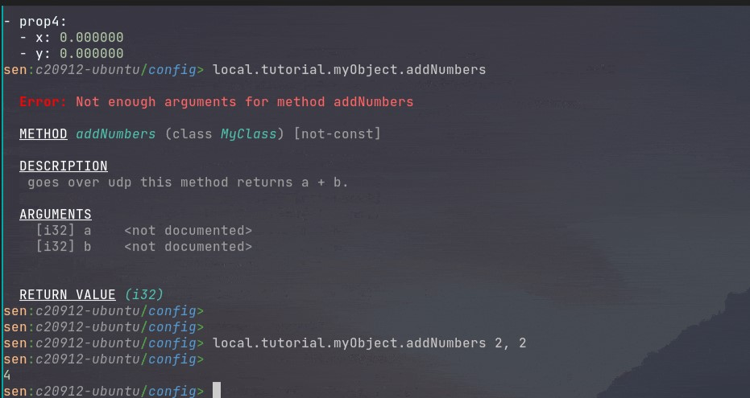

{: style="width:200px; float: right;"}
{: style="width:200px; float: right;"}

# Create your first package

We can ask Sen to create the skeleton for a package called "my_package" that will contain a class
called "MyClass".

```sh
$ sen package init my_package --class MyClass
```

Let's inspect the contents of the newly-created folder:

```{ .shell .annotate }
  my_package
      ├── CMakeLists.txt # (1)!
      ├── config.yaml # (2)!
      ├── src # (3)!
      │   ├── my_class.cpp
      │   └── my_class.h
      └── stl # (4)!
          └── my_package
              ├── basic_types.stl
              └── my_class.stl # (5)!
```

1. :man_raising_hand: Tells CMake how to build our package.
2. :man_raising_hand: Tell the Sen kernel how to use our package.
3. :man_raising_hand: The implementation of our package.
4. :man_raising_hand: Contains the interface of our package.
5. :man_raising_hand: The class that we will implement.

```{ .cmake .annotate }
project(my_package_project VERSION 0.0.1 LANGUAGES CXX C)

if(DEFINED ENV{SEN_PATH}) # (1)!
   list(APPEND CMAKE_PREFIX_PATH "$ENV{SEN_PATH}/cmake") # (2)!
endif()

find_package(sen REQUIRED)

add_sen_package( # (3)!
  TARGET my_package
  MAINTAINER "John Doe (johndoe@mail.com)" # (4)!
  VERSION "0.0.1"   # (5)!
  DESCRIPTION "Implements a simple class"
  SOURCES
    src/my_class.h
    src/my_class.cpp
  STL_FILES
    stl/my_package/my_class.stl
    stl/my_package/basic_types.stl
)
```

1. The `SEN_PATH` environment variable gets defined by our setup script.
2. This enables CMake to find the Sen package below.
3. This function becomes automatically accessible once Sen is found.
4. Not mandatory, but helpful if redistributing the package.
5. You can also use the CMake project version here.

In this file we define a class that has some properties, methods and events. We can provide multiple
implementations of this class (but in this example we are just providing one). You could also import
an STL file from another repository or software asset, and make this package provide an
implementation for it (in that case we would not need to define any STL file here).

```{ .rust .annotate }
import "stl/my_package/basic_types.stl" // (1)!

package my_package;  // (2)!

class MyClass
{
  var prop1 : string       [static];  // (3)!
  var prop2 : StructOfInts [writable];  // (4)!
  var prop3 : MyVariant    [writable, confirmed];  // (5)!
  var prop4 : Vec2;  // (6)!

  // this method returns a + b
  fn addNumbers(a: i32, b: i32) -> i32;

  // change some property
  fn changeProps();

  // fired when something happened
  event somethingHappened();

  // fired when something else happened
  event somethingElseHappened(arg: i32) [confirmed];
}
```

1. Brings in all the types defined in the `basic_types.stl` file (`MyVariant`, `StructOfInts` and
   `Vec2`).
2. Defines the namespace for the types defined in this file.
3. Once defined for a given instance, does not change.
4. Can be set by external callers. Sen generates a setter that's visible from the outside. This
   property goes over UDP.
5. Similar to the previous property, but this one goes over TCP.
6. This property is read-only from the outside (the generated setter method is protected).

A header file for our class is not strictly needed (we could have implemented everything in a CPP
file, but we are structuring it like this to keep it tidy.

```{ .c++ .annotate }
#pragma once

// generated code
#include "stl/my_package/my_class.stl.h" // (1)!

namespace my_package
{

class MyClassImpl: public MyClassBase // (2)!
{
public:
  SEN_NOCOPY_NOMOVE(MyClassImpl) // (3)!

public:
  using MyClassBase::MyClassBase;
  ~MyClassImpl() override = default;

public:
  void update(sen::kernel::RunApi& runApi) override; // (4)!

protected: // (5)!
  int32_t addNumbersImpl(int32_t a, int32_t b) override;
  void changePropsImpl() override;
};

}  // namespace my_package

```

1. For every STL file Sen will generate the equivalent C++ header.
2. `MyClassBase` is generated by Sen. It contains helper functions and all the glue code.
3. This is a helper macro found in the Sen core library. It just disables he copy and move
   operations.
4. We implement this function to ilustrate how we can evolve the state of our object.
5. Our methods are pure virtual in our parent class, so we must implement them.

```{ .c++ .annotate }
#include "my_class.h"

namespace my_package
{

void MyClassImpl::update(sen::kernel::RunApi& /*runApi*/)
{
  setNextProp5(getProp5() + 1); // here goes your update logic
}

int32_t MyClassImpl::addNumbersImpl(int32_t a, int32_t b)
{
  return a + b;
}

void MyClassImpl::changePropsImpl()
{
  Vec2 val = getProp4();
  val.x += 0.5f;        // simply make some changes
  val.y += 1.5;         // to a property, to see the effect
  setNextProp4(val);
}

SEN_EXPORT_CLASS(MyClassImpl) // (1)!

}  // namespace my_package
```

1. Here we are exporting this particular class implementation. This means that users can tell Sen to
   load this package and instantiate `MyClassImpl`s.

```{ .yaml .annotate }
load:
  - name: shell # (1)! 
    group: 2    # (2)! 
    open: [local.example]  # (3)! 

build:
  - name: myComponent    # (4)! 
    freqHz: 30
    group: 3
    imports: [my_package] # (5)!
    objects:
      - class: my_package.MyClassImpl # (6)! 
        name: myObject
        prop1: some value # (7)!
        bus: local.example # (8)!
```

1. Let's load the shell to be able to see something.
2. We run the shell in group 2, and our component in group 3.
3. Automatically open this bus to see the created objects. This way we don't have to manually open it.
4. This is the name of the component that Sen will build for us.
5. We need to import our package for Sen to discover our implementation and instantiate our class.
6. This is the name of the type that provides the implementation. We defined it in `my_class.cpp`.
7. We need to define a value for "prop1" because is static and static properties require an initial value.
8. Our object will be published to this bus. That's why we auto-open it in the shell.

To build and run, we follow the instructions provided by the call to `sen package init`:

- To compile: `cmake -S . -B build && cmake --build build`
- To set up: `export LD_LIBRARY_PATH+=:$(pwd)/build/bin`
- To run: `sen run config.yaml`

From this point you should be able to use the `shell` to inspect and interact with your object.

{: style="width:1200px"}

We can now stop the kernel by using the `shutdown` command.

NOTE: When the Sen executable finishes without error, it prints a :smiley: and returns zero. If it
detects and is able to handle an error it will print a :slightly_frowning_face: and returns
non-zero.
