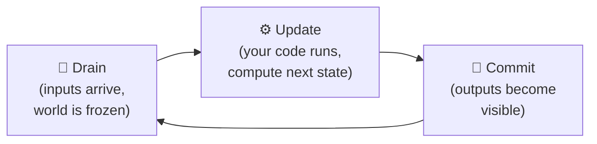
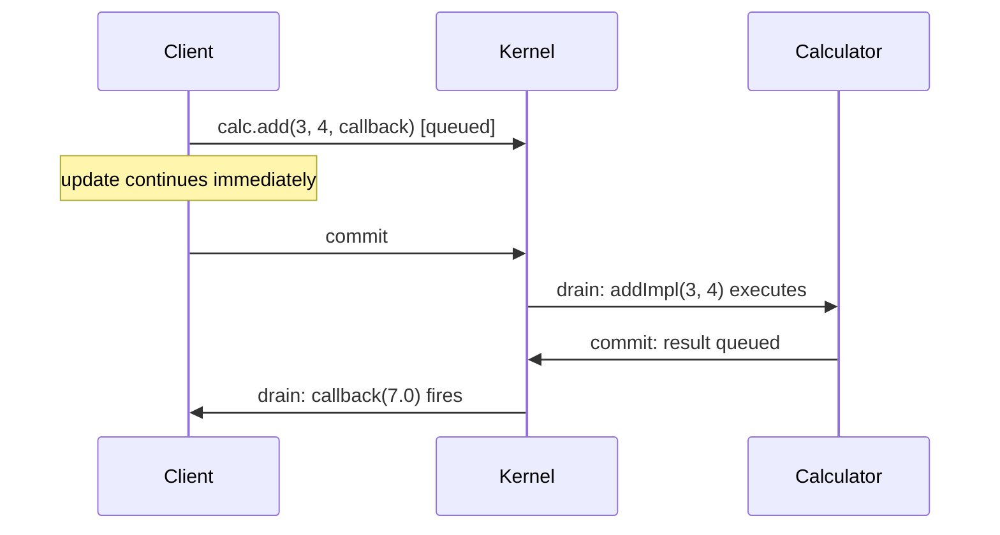

# Understanding Sen: A Mental Model

If you've used gRPC, ROS, DDS, or a message queue before, Sen will feel familiar in some ways and
surprising in others. This page maps Sen's core ideas to patterns you likely already know, and
explains the design decisions that trip up newcomers most often.

---

## The fundamental shift: objects, not messages

Most distributed systems are **message-oriented**: you publish to a topic, you subscribe to a
channel, you send a request and wait for a response. The unit of communication is a blob of data
moving from A to B.

Sen is **object-oriented at the network level**. The unit of communication is an *object* — a thing
with properties, methods, and events that happens to live in our own thread, in a different thread,
in another process, or on another machine. You call methods on it. You read its properties. You subscribe
to its events. The network is transparent.

```
Message-oriented:                    Sen:
  producer → [topic] → consumer        caller.calc.add(3, 4, callback)
  "send data to a name"                "call a method on an object"
```

This changes how you think about discovery, state, and failure. You are not routing packets — you
are working with live objects.

---

## The drain-update-commit cycle

This is the single most important thing to understand about Sen. Everything else follows from it.

### The problem it solves

Imagine two objects running in separate threads, both reading and writing shared state. Without
coordination, object A might read a property that object B is halfway through updating. You get
corrupted data, race conditions, or subtle non-determinism. The traditional solution is locks — but
locks are easy to get wrong and make testing hard.

Sen's solution is the **drain-update-commit cycle**: every component runs in discrete steps, and
the world is frozen during each step.

### The cycle



**Drain** — Sen collects all pending inputs: changed properties from other objects, incoming method
calls, events from other components. It applies them to a snapshot. From this point until commit,
the snapshot is frozen. Nothing changes. Time itself is frozen.

**Update** — Sen calls `update()` on your objects. You read the frozen snapshot with `getProp()`.
You compute your next state. You write to the *next* buffer with `setNextProp()`. You call methods
on other objects. None of your writes are visible yet — not even to yourself.

**Commit** — Sen atomically flips the buffers. Your staged property values become the new current
values. Your queued method calls and events are dispatched.

### The double-buffer analogy

Think of it like rendering frames in a game engine:

- The *current buffer* is the live display. You read from it, but you never write directly to it
  during a frame.
- The *next buffer* is where you render. When the frame is done, you flip.

`getProp()` reads from the current buffer. `setNextProp()` writes to the next buffer.

!!! abstract "Why `setNextProp()` and not `setProp()`?"
    If `setProp()` wrote directly to the current buffer, a different part of the code running in the same
    cycle might read your half-updated state. By writing to the next buffer, Sen guarantees every
    component sees a fully consistent snapshot throughout its entire update. The flip — the
    `commit` — happens atomically, between cycles.

### Determinism

Because every component sees the same frozen snapshot during its update, the system is
**deterministic**: given the same inputs, the same sequence of outputs is produced every time. This
makes testing and debugging vastly easier. It also enables *stepped execution* — you can advance the
clock one cycle at a time and inspect the exact state at each step.

---

## Method calls are asynchronous — always

When you call a method on a Sen object, the call is **queued**, not executed immediately. The
execution happens on the target object's next drain cycle. The result comes back as a callback on
your next drain, one or two cycles later.



### Why always async?

Because the drain-update-commit cycle requires it. If a method call executed immediately inside your
update, the callee would be running inside the caller's update step — breaking the cycle's isolation
guarantee. Making all calls asynchronous means every object's update runs in a clean, isolated step.

As a side effect, **no object can ever be blocked waiting for another**. The system cannot deadlock.

!!! tip "Working with async results"
    The callback pattern is the correct way to consume results:
    ```cpp
    calc.add(3.0, 4.0, {this, [this](sen::MethodResult<double> r) {
        if (r.isOk())
        {
           std::cout << r.getValue() << std::endl;
        }
    });
    ```
    Do not try to wait in a loop — there is nothing to wait for within a single update step.

---

## How objects find each other: buses and interests

### The namespace hierarchy

Sen objects live in a three-level namespace:

```
session.bus.objectName

e.g.:  monitoring.headquarters.sensor42
       ^^^^^^^^^^ ^^^^^^^^^^^^ ^^^^^^^^
       session    bus          object
```

Sessions group unrelated systems (like namespaces). Buses partition communication within a session
(like folders). Objects are published to a bus and discovered by other components that watch the
same bus.

This is not a registry or a service locator. No central authority assigns names. Objects
self-publish, and consumers declare what they are looking for.

### Subscriptions and interests

To discover objects, you declare an **interest** — a filter — and Sen gives you a live list:

```cpp
// In registered():
subscription_ = api.selectAllFrom<SensorInterface>("monitoring.headquarters");
```

`subscription_->list` is automatically populated during each drain. Objects appear when they
register, disappear when they unregister. You never hold stale pointers.

!!! warning "Keep the Subscription alive"
    `Subscription<T>` must be a **member variable** of your object, not a local. If it goes out
    of scope, the list is cleared and updates stop — silently. This is one of the most common
    newcomer mistakes.

---

## Why the code generator?

Sen's type system requires that every object type be known at both compile time (for type safety in
C++) and at runtime (for serialization, shell introspection, and network transport).

Writing that boilerplate by hand for every class would mean hundreds of lines of serialization code,
virtual dispatch tables, and metadata registration — all error-prone and tedious.

The code generator takes your STL interface definition and produces:

| Generated piece | What it does |
|-----------------|-------------|
| `MyClassBase` | The base class you inherit from |
| `getMyProp()` / `setNextMyProp()` | Typed accessors for every property |
| `virtual myMethodImpl(...)` | Pure virtual methods you override |
| Serialization code | Reads/writes properties to the network |
| Runtime type metadata | Powers the shell, explorer, and recorder |

You write the STL (the *what*), the generator writes the boilerplate (the *how*), and you implement
the logic (the *why*).

---

## Quality of service: confirmed vs. best-effort

Every property, method and event in STL can have a quality-of-service attribute:

| | Confirmed | Best-effort (default) |
|---|---|---|
| **Transport** | TCP | UDP |
| **Guarantee** | Reliable, ordered | No guarantee, no ordering |
| **Use for** | Critical data, method calls | High-frequency updates |
| **STL syntax** | `[confirmed]` | *(omit the flag)* |

In a well-behaved local network, you will almost never lose UDP packets, so best-effort is fine for
most property updates. Use `confirmed` when you genuinely cannot afford to miss a value — for
example, a method call that triggers an irreversible action.

---

## If you're coming from...

### ROS / ROS 2

| ROS concept | Sen equivalent |
|-------------|---------------|
| Topic (pub/sub) | Object property or event on a bus |
| Service (request/response) | Method call with async callback |
| Node | Component (with one or more objects) |
| Package | Package (same concept) |
| URDF / message definition | STL interface definition |

The biggest difference: in ROS you subscribe to a *named topic* (a string). In Sen you subscribe to
a *type* (a class defined in STL), and the kernel gives you typed C++ references. There is no
message struct — you call methods and read properties directly.

### gRPC / REST

Sen method calls look like RPC, but the execution model is different:

- In gRPC: you block until the server responds (or use async stubs explicitly).
- In Sen: every call is async. You provide a callback. The call is never blocking.

Sen objects are also persistent and stateful — they are not stateless handlers. A `Calculator`
object holds a `current` value across calls, just like a C++ object would.

### DDS / SOME/IP

Sen's quality-of-service model (confirmed = TCP, best-effort = UDP) maps directly to DDS
reliability policies. The key difference is the programming model: DDS is centered on typed topics
and data readers/writers. Sen is centered on objects with methods, properties, and events — the
underlying transport is managed for you.

### In-process C++ (no networking)

If you've only used Sen in a single-process context and are adding networking, the good news is: you
change nothing in your code. You add an `ether` component to your YAML config and Sen handles the
rest. Objects in remote processes behave identically to local objects from your code's perspective.

---

## Five things to remember

1. **Double-buffer**: `getProp()` reads the frozen current snapshot; `setNextProp()` writes to the
   next buffer. Changes become visible after commit.

2. **Async always**: method calls are queued and execute 1–2 cycles later. Handle results in
   callbacks, not in the same update step.

3. **Subscriptions are live**: `Subscription<T>` automatically reflects objects appearing and
   disappearing. Keep it as a member variable.

4. **Groups control startup order**: lower group numbers start first and stop last. Put dependencies
   in a lower group than the things that depend on them.

5. **`SEN_EXPORT_CLASS` is mandatory**: without it, your class is invisible to the kernel —
   no error, just nothing instantiated.
