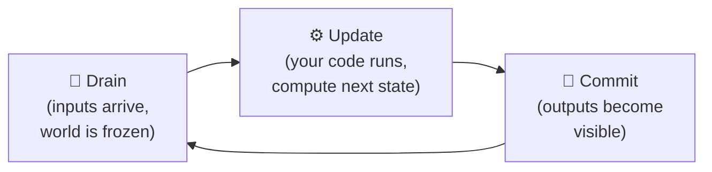
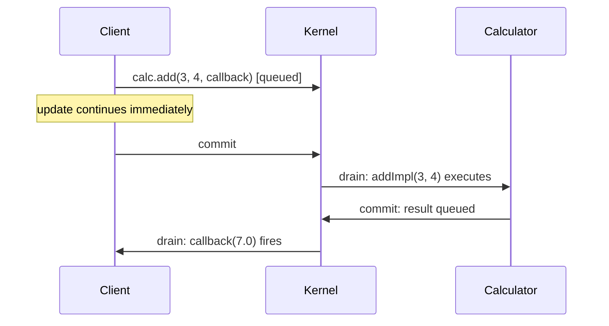

# Understanding Sen: a mental model

If you've used gRPC, ROS, DDS, HLA, DIS, or a message queue before, Sen will feel familiar in some
ways and surprising in others. This page maps Sen's core ideas to patterns you likely already know, and
explains the design decisions that trip up newcomers most often.

---

## The fundamental shift: objects, not messages

Most distributed systems are **message-oriented**: you publish to a topic, you subscribe to a
channel, you send a request and wait for a response. The unit of communication is a blob of data
moving from A to B.

Sen is **object-oriented at the network level**. The unit of communication is an *object*, a thing
with properties, methods, and events that happens to live in your own thread, in a different thread,
in another process, or on another machine. You call methods on it. You read its properties. You
subscribe to its events. The network is transparent.

```yaml
Message-oriented:                    Sen:
  producer → [topic] → consumer        caller.calc.add(3, 4, callback)
  "send data to a name"                "call a method on an object"
```

This changes how you think about discovery, state, and failure. You are not routing packets. You
are working with live objects.

---

## The drain-update-commit cycle

This is the single most important thing to understand about Sen. Everything else follows from it.

### The problem it solves

Imagine two objects running in separate threads, both reading and writing shared state. Without
coordination, object A might read a property that object B is halfway through updating. You get
corrupted data, race conditions, or subtle non-determinism. The traditional solution is locks, but
locks are easy to get wrong and make testing hard.

Sen's solution is the **drain-update-commit cycle**: every component runs in discrete steps, and
the world is frozen during each step.

### The cycle


```mermaid
graph LR
    D["🔽 Drain\n(inputs arrive,\nworld is frozen)"]
    U["⚙️ Update\n(your code runs,\ncompute next state)"]
    C["🔼 Commit\n(outputs become\nvisible)"]
    D --> U --> C --> D
```

**Drain.** Sen applies everything that arrived to a snapshot. From this point until commit, the
snapshot is frozen. Nothing changes. Time itself is frozen.

**Update.** Sen calls `update()` on your objects. You read the frozen snapshot with
<code>get&lt;<var>Prop</var>&gt;()</code> and stage your next state with
<code>setNext&lt;<var>Prop</var>&gt;()</code>. None of it is visible to anyone else yet, and
<code>get&lt;<var>Prop</var>&gt;()</code> still returns the value from the start of the cycle. To
read back something you staged, use <code>getNext&lt;<var>Prop</var>&gt;()</code>.

**Commit.** Sen atomically flips the buffers. Your staged property values become the new current
values. Your queued method calls and events are dispatched.

[Execution model](execution_model.md#the-drain-update-commit-cycle) lists exactly what Sen does in
each of the three stages.

### The double-buffer analogy

Think of it like rendering frames in a game engine:

- The *current buffer* is the live display. You read from it, but you never write directly to it
  during a frame.
- The *next buffer* is where you render. When the frame is done, you flip.

<code>get&lt;<var>Prop</var>&gt;()</code> reads from the current buffer.
<code>setNext&lt;<var>Prop</var>&gt;()</code> writes to the next buffer.

!!! abstract "Why <code>setNext&lt;<var>Prop</var>&gt;()</code> and not <code>set&lt;<var>Prop</var>&gt;()</code>?"
    If <code>set&lt;<var>Prop</var>&gt;()</code> wrote directly to the current buffer, a different
    part of the code running in the same cycle might read your half-updated state. By writing to the
    next buffer, Sen guarantees every component sees a fully consistent snapshot throughout its
    entire update. The flip (the `commit`) happens atomically, between cycles.

### Determinism

Because every component sees the same frozen snapshot during its update, the system is
**deterministic**: given the same inputs, the same sequence of outputs is produced
every time. This makes testing and debugging vastly easier. It also enables *stepped execution*,
letting you advance the clock one cycle at a time and inspect the exact state at each step.

Today, determinism is possible within a single process (even if it hosts multiple components). Across
processes a run is not yet reproducible step for step. A lock-stepped distributed execution mechanism
that would extend the guarantee is in progress.

---

## Method calls are always asynchronous

When you call a method on a Sen object, the call is **queued**, not executed immediately. The
execution happens on the target object's next drain cycle. The result comes back as a callback on
your next drain, one or two cycles later.


```mermaid
sequenceDiagram
    participant Client
    participant Kernel
    participant Calculator

    Client->>Kernel: calc.add(3, 4, callback)  [queued]
    Note over Client: update continues immediately
    Client->>Kernel: commit
    Kernel->>Calculator: drain: addImpl(3, 4) executes
    Calculator->>Kernel: commit: result queued
    Kernel->>Client: drain: callback(7.0) fires
```

### Why always async?

Because the drain-update-commit cycle requires it. If a method call executed immediately inside your
update, the callee would be running inside the caller's update step, breaking the cycle's isolation
guarantee. Making all calls asynchronous means every object's update runs in a clean, isolated step.

As a side effect, **no object can ever be blocked waiting for another**. The system cannot deadlock.

That covers objects inside the cycle, which is where your logic normally lives. Outside it, the
Python component's `waitUntil` and `syncCalls` hold the *script*, but keep draining,
updating and committing while they wait, so the object being waited on still makes progress. And a
component you write yourself in C++ can own a socket or an external event loop, where blocking and
its protection are yours to arrange; [Writing a component](../howto_guides/components.md) covers
that case.

!!! tip "Working with async results"
    The callback pattern is the correct way to consume results:
    ```cpp
    calc.add(3.0F, 4.0F, {this, [this](sen::MethodResult<float32_t> r)
    {
        if (r.isOk())
        {
           std::cout << r.getValue() << std::endl;
        }
    }});
    ```
    Do not try to wait in a loop. There is nothing to wait for within a single update step.

---

## How objects find each other: buses and interests

### The namespace hierarchy

Sen objects live in a three-level namespace:

```text
session.bus.objectName

e.g.:  monitoring.headquarters.sensor42
       ^^^^^^^^^^ ^^^^^^^^^^^^ ^^^^^^^^
       session    bus          object
```

Sessions group unrelated systems (like namespaces). Buses partition communication within a session
(like folders). Objects are published to a bus and discovered by other components that watch the
same bus.

This is not a registry or a service locator. No central authority assigns names. Objects
self-publish, and consumers declare what they are looking for.

### Subscriptions and interests

To discover objects, you declare an **interest** (a filter), and Sen gives you a live list:

```cpp
// In registered():
subscription_ = api.selectAllFrom<SensorInterface>("monitoring.headquarters");
```

`subscription_->list` is automatically populated during each drain. Objects appear when they
register and disappear when they unregister, and they also leave the list when a property named in
the interest's `WHERE` clause changes so that the object no longer matches. That second case is a
live object dropping out of your view rather than a dead one. Within a cycle the list does not
change, so you never hold stale pointers.

!!! warning "Keep the Subscription alive"
    `Subscription<T>` must be a **member variable** of your object, not a local. If it goes out
    of scope, the list is cleared and updates stop silently. This is one of the most common
    newcomer mistakes.

---

## Why the code generator?

Sen's type system requires that every object type be known at both compile time (for type safety in
C++) and at runtime (for serialization, shell introspection, and network transport).

Writing that boilerplate by hand for every class would mean hundreds of lines of serialization code,
virtual dispatch tables, and metadata registration, all error-prone and tedious.

The code generator takes your STL interface definition and produces:

| Generated piece | What it does |
|-----------------|-------------|
| `MyClassBase` | The base class you inherit from |
| <code>get&lt;<var>Prop</var>&gt;()</code> / <code>setNext&lt;<var>Prop</var>&gt;()</code> | Typed accessors for every property |
| `virtual myMethodImpl(...)` | Pure virtual methods you override |
| Serialization code | Reads/writes properties to the network |
| Runtime type metadata | Powers the shell, explorer, and recorder |

You write the STL (the *what*), the generator writes the boilerplate (the *how*), and you implement
the logic (the *why*).

---

## Quality of service: confirmed vs. best-effort

Every property, method and event in STL can have a quality-of-service attribute:

| | Confirmed | Best-effort |
|---|---|---|
| **Transport** | TCP | UDP |
| **Guarantee** | Reliable, ordered | No guarantee, no ordering |
| **Use for** | Critical data, method calls | High-frequency updates |
| **STL syntax** | `[confirmed]` | `[bestEffort]` |

Which one you get by default depends on what you are declaring: **methods are confirmed**, while
properties and events are best-effort. Writing `[confirmed]` on a property or an event moves it onto
the reliable transport.

`[bestEffort]` is not the mirror image of that, and the table above simplifies. Best-effort comes in
two forms: properties and events already arrive over UDP multicast, and `[bestEffort]` narrows them
to UDP unicast. So writing it is a change of transport, not a way of asking for the default you
already have. Methods, which start confirmed, do move to unicast when you write it.

In a well-behaved local network, you will almost never lose UDP packets, so best-effort is fine for
most property updates. Use `confirmed` when you genuinely cannot afford to miss a value.

One case takes the choice away from you. A dynamic property whose size is unbounded, such as a
`string` or an unbounded `sequence`, has to be `[confirmed]`, and writing nothing is not enough:
the default is already best-effort, so it is rejected too. Declaring `var name : string;` fails
with "unbounded dynamic properties with non-confirmed transport mode may cause data loss". Static
properties are exempt, since they never travel as updates.

---

## If you're coming from…

### ROS / ROS 2

| ROS concept | Sen equivalent |
|-------------|---------------|
| Topic (pub/sub) | Object property or event on a bus |
| Service (request/response) | Method call with async callback |
| Node | Component (with one or more objects) |
| Package | Package (same concept) |
| URDF / message definition | STL interface definition |

The biggest difference: in ROS you subscribe to a *named topic* (a string). In Sen you subscribe to
a *type* (a class defined in STL), and the kernel gives you typed C++ references. There is no
message struct. You call methods and read properties directly.

### gRPC / REST

Sen method calls look like RPC, but the execution model is different:

- In gRPC: you block until the server responds (or use async stubs explicitly).
- In Sen: every call is async. You provide a callback. The call is never blocking.

Sen objects are also persistent and stateful, not stateless handlers. A `Calculator`
object holds a `current` value across calls, just like a C++ object would.

### DDS / SOME/IP

Sen's quality-of-service model (confirmed = TCP, best-effort = UDP) maps directly to DDS
reliability policies. The key difference is the programming model: DDS is centered on typed topics
and data readers/writers. Sen is centered on objects with methods, properties, and events. The
underlying transport is managed for you.

### HLA or DIS

Sen does not aim to replace HLA or DIS, but there are some areas where the needs and solutions overlap.

Sen reads HLA FOMs and generates types from them, but it is not an RTI and does not natively join
federations. As with any other protocol, that is done by writing an adapter. The vocabulary collides
badly, so the map matters more here than anywhere else:

| What you call it               | Sen's equivalent                                                                                                                                                                                                                                                                                                                                                                                               |
|--------------------------------|----------------------------------------------------------------------------------------------------------------------------------------------------------------------------------------------------------------------------------------------------------------------------------------------------------------------------------------------------------------------------------------------------------------|
| Federate                       | A Sen kernel. The resemblance stops there: what one federate does is usually split across several *components* inside that kernel, each a thread owning its own objects                                                                                                                                                                                                                                        |
| Federation execution (loosely) | A session. There is nothing to create, join or leave (a session exists because someone used the name), but the separation is real: the name feeds the multicast addressing, and participants ignore remote kernels from other sessions                                                                                                                                                                         |
| RTI                            | No equivalent. Sen is broker-less: kernels find each other over `ether`                                                                                                                                                                                                                                                                                                                                        |
| FOM                            | The STL types your project shares. If the FOM itself has to be the agreement, as taking part in a federation requires, write your data model as a FOM and compile it: Sen reads it and the FOM stays the shared artifact. STL is not a FOM and carries no part of the HLA contract. See [Using HLA FOMs](hla.md)                                                                                               |
| SOM                            | No equivalent today. The configuration answers part of the same question (and machine checking it is possible: `imports` bounds what a component can offer, and `objects` says which of those it instantiates and on which bus. The subscribing side is there too when a component takes its interests from configuration. Generating a SOM would be technically possible, but it is currently not implemented. |
| Object class, attribute        | Class, property                                                                                                                                                                                                                                                                                                                                                                                                |
| Interaction                    | Methods and events. You can map interactions onto a method or event of a class you nominate                                                                                                                                                                                                                                                                                                                    |
| Declaration Management         | Partly. Subscription is the `SELECT <class> FROM <bus>` part of an interest; publication is instantiating an object on a bus, bounded by `imports:` and `build:`. HLA declares at attribute level, while a Sen interest is per class and delivers whole objects                                                                                                                                                |
| DDM regions                    | Loosely, the `WHERE` part of a [Sen Query Language](sql.md) interest, matched against real attribute values rather than a routing space. Filtering happens on both the producing and the consuming side. A FOM's own `dimensions` are dropped on import, so the model's DDM declarations do not carry over; see [Using HLA FOMs](hla.md)                                                                       |
| Dead reckoning                 | `sen::util` implements all nine IEEE 1278.1-2012 Annex E algorithms, plus smoothing. See [the util library](util_library.md)                                                                                                                                                                                                                                                                                   |

Some HLA services have no row because Sen leaves them to the application: simulation time, ownership
transfer, save and restore. Sen does not assume that it holds all the state of the objects in play,
nor that it owns the time source for simulation purposes. It runs real time, stepped or faster than
real time, and projects build what they need on top of that. What it does give a model is described
in [the execution model](execution_model.md#the-time-your-model-sees). They do, and in more than one way:
`sen::db` is one route to save and restore.

### In-process C++ (no networking)

If you've only used Sen in a single-process context and are adding networking, the good news is: you
change nothing in your code. You add an `ether` component to your YAML config and Sen handles the
rest. Objects in remote processes behave identically to local objects from your code's perspective.

---

## What to remember

1. **Double-buffer**: <code>get&lt;<var>Prop</var>&gt;()</code> reads the frozen current snapshot;
   <code>setNext&lt;<var>Prop</var>&gt;()</code> writes to the next buffer. Changes become visible
   after commit.

2. **Async always**: method calls are queued and execute 1–2 cycles later. Handle results in
   callbacks, not in the same update step.

3. **Subscriptions are live**: `Subscription<T>` automatically reflects objects appearing and
   disappearing. Keep it as a member variable.

4. **Groups control startup order**: lower group numbers start first and stop last. Put dependencies
   in a lower group than the things that depend on them. This page does not cover groups;
   [Using component groups](../howto_guides/using_groups.md) has the rules.

5. **`SEN_EXPORT_CLASS` is mandatory**: without it the kernel cannot find your class, and stops at
   startup with `could not find type '<package>.<Class>' in any of the imported libraries`, naming
   the symbol it looked for. [Creating your first package](../getting_started/first_package.md)
   shows where the macro goes.
