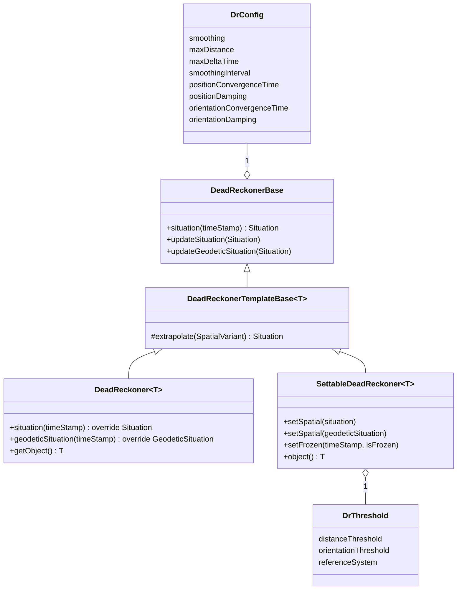
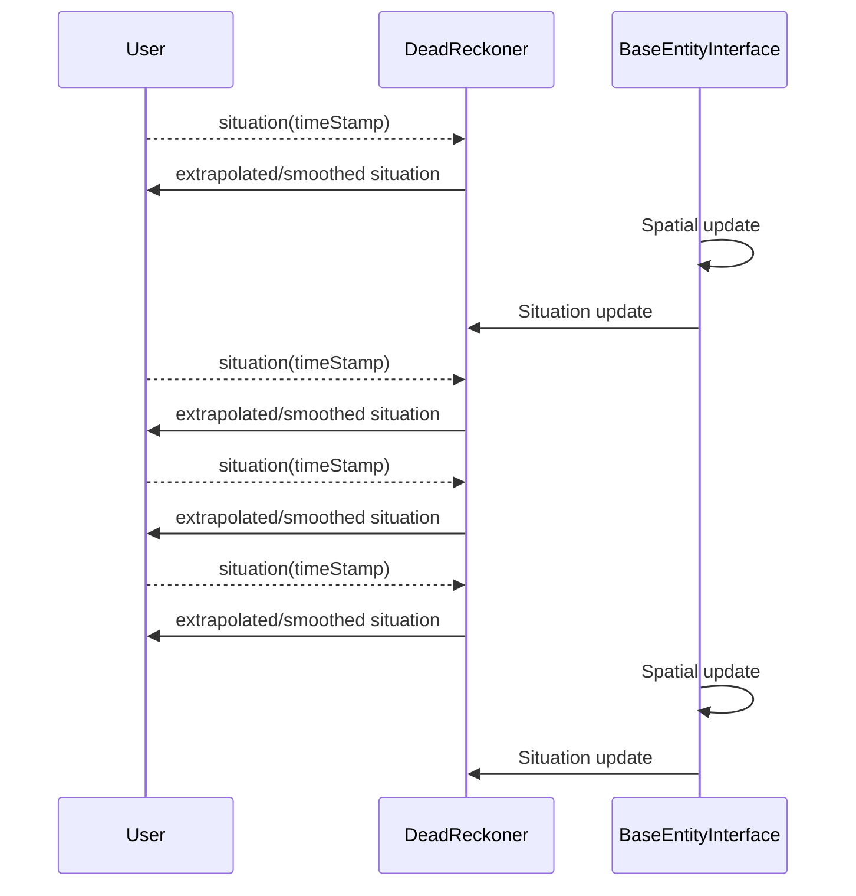
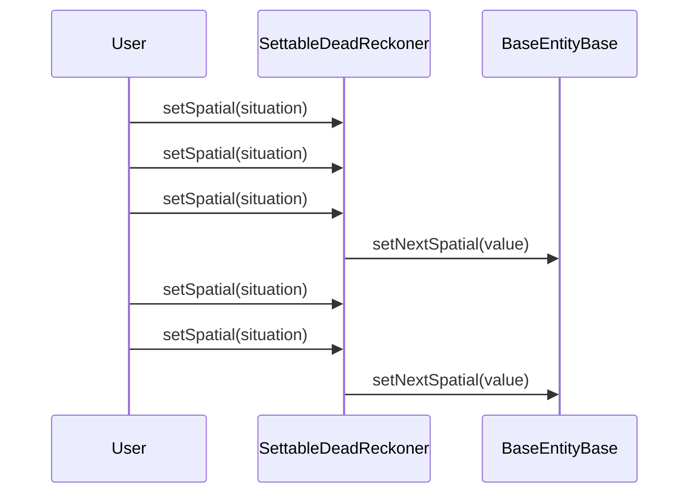

# sen::util

This library houses Sen tools that, while not part of the Sen core, are frequently used within Sen
environments.

This library includes Dead Reckoning utilities.

Check out the [API Reference](../doxygen/html/index.html) for a detailed description of the Sen Util
library.

## Dead Reckoning Utilities

### What is it?

Dead Reckoning is a computational technique used in distributed simulations and networked
applications to minimize data transmission by predicting the movement of entities between infrequent
state updates. Instead of continuously transmitting real time positions, participants extrapolate
future states using kinematic models based on last-known data (position, velocity, acceleration)
reducing bandwidth consumption while maintaining perceived synchrony.

This library enables the computation of Dead Reckoning extrapolations on entities by using these two
APIs:

- The base API where a custom `Situation` struct is used for the extrapolation.
- An API adapted to FOM which takes a `BaseEntity` object and extrapolates its spatial situation
  following the algorithms specified in IEEE 1278.1-1995 Annex B.

Additionally, this library allows users to update `BaseEntity` objects based on error thresholds
between real-time data and extrapolated values, thereby reducing spatial data transmission.

### How to use it?

Information on how to use the Dead Reckoning library can be found in this
[guide](../howto_guides/dead_reckoning.md).

### Detailed design

This section targets readers interested in the detailed design of the Dead Reckoning library.

#### Our main goals

The primary objectives that motivated the design of this library are as follows:

- **Coverage**: This library extrapolates position and orientation data for all the Dead Reckoning
  algorithms contemplated in the IEEE 1278.1-1995 Annex B.

- **Performance**: Dead Reckoning extrapolations are usually computed at a frequency higher than the
  network's frequency, thus making efficiency a key requirement of this library. All the algorithms
  were implemented paying attention to their computational performance, e.g., using quaternions
  instead of matrix multiplications for rotations.

- **User Friendly**: The API of the library was made as simple as possible for the user, only
  requiring the user to provide a simple Smoothing/Threshold configuration and a reference to the
  Sen object (local/remote).

- **A library, not a package**: This software is a Sen library, but it is not a package. This can be
  confusing because Sen packages are also .so files (shared library). Being a Sen library means that
  it provides a set of helpers which can be used by another package, but it cannot be instantiated
  directly by the Sen Kernel.

A general diagram of the library is shown below:



The `DeadReckonerBase` class encapsulates the core functionality of the dead reckoning, and that
class can be directly used to extrapolate (and optionally smooth) any `Situation` that does not need
to be coming from the `Spatial` field of a FOM object.

The `DeadReckonerTemplateBase<T>` class particularizes this functionality for FOM objects and the
`DeadReckoner<T>` and `SettableDeadReckoner<T>` classes inherit from it.

#### Data models and configuration

The dead reckoning library allows the user to extrapolate the position/orientation of an entity
using data in the form of the following two structs:

```c++ title="sen::util::Situation"
/// Situation structure with the following parameters:
struct Situation
{
  /// When true, no extrapolation is performed because the entity is frozen.
  bool isFrozen = false;

  /// TimeStamp of the instant when the situation is computed.
  sen::TimeStamp timeStamp {};

  ///  Position in ECEF.
  Location worldLocation {};

  /// Orientation of the body reference system (x forward, y right, z down) with respect to ECEF.
  Orientation orientation {};

  /// Velocity vector with respect to ECEF or body reference system (depending on
  /// the reference system of the algorithm extrapolated).
  Velocity velocityVector {};

  /// Angular velocity vector with respect to body reference system.
  AngularVelocity angularVelocity {};

  /// Acceleration vector with respect to ECEF or body reference system (depending on
  /// the reference system of the algorithm extrapolated).
  Acceleration accelerationVector {};

  /// Angular acceleration vector with respect to body reference system.
  AngularAcceleration angularAcceleration {};
};
```

```c++ title="sen::util::GeodeticSituation"
/// GeodeticSituation structure with the following parameters:
struct GeodeticSituation
{
  /// When true, no extrapolation is performed because the entity is frozen.
  bool isFrozen = false;

  /// TimeStamp of the instant when the situation is computed.
  sen::TimeStamp timeStamp {};

  /// World Location in Geodetic (Latitude, Longitude, Altitude).
  GeodeticWorldLocation worldLocation {};

  /// Orientation of the body reference system (x forward, y right, z down)
  /// with respect to NED (North - East - Down).
  Orientation orientation {};

  /// Velocity vector with respect to NED.
  Velocity velocityVector {};

  /// Angular velocity vector with respect to body-reference system.
  AngularVelocity angularVelocity {};

  ///  Acceleration vector with respect to NED.
  Acceleration accelerationVector {};

  /// Angular acceleration vector with respect to body-reference system.
  AngularAcceleration angularAcceleration {};
};
```

Additionally, the dead reckoning takes the following configuration:

```c++ title="sen::util::DrConfig"
/// Dead Reckoning configuration.
struct DrConfig
{
  /// If true, the position and orientation of the input data is smoothed removing noise
  bool smoothing = true;

  ///  No smoothing is performed for displacements bigger than this distance.
  LengthMeters maxDistance = 100000.0;

  /// No smoothing is performed for time deltas bigger than this duration
  sen::Duration maxDeltaTime {std::chrono::seconds(1)};

  /// Maximum time interval used to update the smoothed solution. It is used to prevent the smoothed solution from
  /// becoming unstable.
  sen::Duration smoothingInterval {std::chrono::milliseconds(20)};

  /// Convergence time for the smoothed position to match the updated position
  sen::Duration positionConvergenceTime {std::chrono::milliseconds(500)};

  /// Damping coefficient for the smoothed position solution.
  DampingCoefficient positionDamping = 1.0;

  /// Convergence time for the smoothed orientation to match the updated orientation
  sen::Duration orientationConvergenceTime {std::chrono::milliseconds(50)};

  /// Damping coefficient for the smoothed orientation solution.
  DampingCoefficient orientationDamping = 20.0;
};
```

The default values provided in the `DrConfig` where trimmed to ensure a good performance in the
majority of scenarios but can be freely changed by the user.

#### The Dead Reckoner Base

The `DeadReckonerBase` has the following API:

```c++ title="DeadReckonerBase API"
/// Extrapolates the Situation of an entity at a certain time. The extrapolation is smoothed by
/// default unless the user specifies otherwise.
class DeadReckonerBase
{

public:
  SEN_NOCOPY_NOMOVE(DeadReckonerBase)

public:
  explicit DeadReckonerBase(DrConfig config = {});
  virtual ~DeadReckonerBase() = default;

public:
  /// Returns the extrapolated/smoothed situation of the object at the timestamp introduced as argument, expressed in
  /// the following coordinates:
  /// - World position: ECEF coordinates
  /// - Orientation: Euler angles of the body reference system (x forward, y right, z down) with respect to ECEF
  /// - Velocity: In world coordinates for world-centered DR algorithms and in body coordinates for body-centered
  /// algorithms
  /// - Acceleration: In world coordinates for world-centered DR algorithms and in body coordinates for body-centered
  /// algorithms
  /// - AngularVelocity: In body coordinates.
  /// - AngularAcceleration: In body coordinates.
  [[nodiscard]] virtual Situation situation(sen::TimeStamp timeStamp);

  /// Returns the extrapolated/smoothed situation of the object at the timestamp introduced as argument, expressed in
  /// the following coordinates:
  /// - World position: Geodetic Latitude, Longitude and Altitude
  /// - Orientation: Euler angles of the body reference system (x forward, y right, z down) with respect to NED
  /// - Velocity: In NED coordinates for world-referenced algorithms, in body coordinates for body-referenced
  /// algorithms.
  /// - Acceleration: In NED coordinates for world-referenced algorithms, in body coordinates for body-referenced
  /// algorithms.
  /// - AngularVelocity: In body coordinates.
  /// - AngularAcceleration: In body coordinates.
  [[nodiscard]] virtual GeodeticSituation geodeticSituation(sen::TimeStamp timeStamp);

  /// Updates the last known real time Situation. A valid timestamp is needed inside the Situation provided as
  /// argument.
  void updateSituation(const Situation& value);

  /// Updates the last known real time GeodeticSituation. A valid timestamp is needed inside the GeodeticSituation
  /// provided as argument.
  void updateGeodeticSituation(const GeodeticSituation& value);

public:  // config
  [[nodiscard]] const DrConfig& getConfig() const noexcept;
  void setConfig(const DrConfig& config);

protected:
  [[nodiscard]] const Situation& getSmoothSituation() const noexcept;
  void smooth(const Situation& update);

private:
  DrConfig config_;
  Situation lastSituation_;
  Situation smoothSituation_;
};
```

Where the user needs to call `updateSituation` (with a situation containing a valid timestamp) every
time the last-known data can be updated. Calling `situation` or `geodeticSituation` retrieves the
position/orientation extrapolated to the timestamp provided as argument.

#### The Dead Reckoner

The `DeadReckoner<T>` provides an API to the user tailored to accept `rpr::BaseEntityInterface` FOM
objects and perform extrapolations on them following the algorithms specified in IEEE 1278.1-1995
Annex B. The FOM entity updates are detected automatically in this case. The API is shown below:

```c++ title="DeadReckoner API"
template <typename T>
class DeadReckoner: public DeadReckonerTemplateBase<T>
{
public:
  SEN_NOCOPY_NOMOVE(DeadReckoner)

public:  // RPR types from DeadReckonerTemplateBase
  using Parent = DeadReckonerTemplateBase<T>;
  using SpatialVariant = typename Parent::SpatialVariant;
  using StaticSpatial = typename Parent::StaticSpatial;
  using FpsSpatial = typename Parent::FpsSpatial;
  using RpsSpatial = typename Parent::RpsSpatial;
  using RvsSpatial = typename Parent::RvsSpatial;
  using FvsSpatial = typename Parent::FvsSpatial;
  using RprLocation = typename Parent::RprLocation;
  using RprOrientation = typename Parent::RprOrientation;
  using RprVelocity = typename Parent::RprVelocity;
  using RprAcceleration = typename Parent::RprAcceleration;
  using RprAngularVelocity = typename Parent::RprAngularVelocity;

public:  // type aliases
  using SituationProcessor = std::function<Situation(sen::TimeStamp)>;
  using GeodeticSituationProcessor = std::function<GeodeticSituation(sen::TimeStamp)>;

public:
  /// Constructor for the DeadReckoner where an object inheriting from rpr::BaseEntity is inputted as a reference.
  /// This is the easiest version of the API to instantiate a DeadReckoner.
  explicit DeadReckoner(const T& object, DrConfig config = {});
  ~DeadReckoner() override = default;

public: // overrides DeadReckonerBase
  [[nodiscard]] Situation situation(sen::TimeStamp timeStamp) override;
  [[nodiscard]] GeodeticSituation geodeticSituation(sen::TimeStamp timeStamp) override;

public:
  /// Provides direct mutable access to the internal object managed by this instance of the DeadReckoner
  [[nodiscard]] T& getObject() noexcept;

public:  // situation translation helpers
  /// Translates a SpatialVariant to a Situation struct
  [[nodiscard]] static Situation toSituation(const SpatialVariant& spatial, sen::TimeStamp timeStamp = {});

  /// Translates a SpatialVariant to a GeodeticSituation struct
  [[nodiscard]] static GeodeticSituation toGeodeticSituation(const SpatialVariant& spatial,
                                                             sen::TimeStamp timeStamp = {});

private:
  /// Provides the situation processor that will be executed depending on the type of DR algorithm used
  /// (body-centered or world-centered). NOTE: Smoothing is only available for world centered algorithms.
  [[nodiscard]] SituationProcessor getSituationProcessor(bool bodyReferenced);

  /// Provides the geodetic situation processor that will be executed depending on the type of DR algorithm used
  /// (body-centered or world-centered). NOTE: Smoothing is only available for world centered algorithms.
  [[nodiscard]] GeodeticSituationProcessor getGeodeticSituationProcessor(bool bodyReferenced);

  /// Updates the lastSpatial and lastTimeStamp members when a new Spatial is received
  void updateSpatial(sen::TimeStamp time);

private:
  const T& object_;
  SituationProcessor processSituation_;
  GeodeticSituationProcessor processGeodeticSituation_;
  sen::TimeStamp lastTimeStamp_;
  SpatialVariant lastSpatial_;
};
```

The following diagram shows how the dead reckoner performs extrapolations of the `rpr::BaseEntity`
object:



#### The Settable Dead Reckoner

The main functionality of the `SettableDeadReckoner<T>` is to allow an application to write
`Spatial` data in a local object of type T (inheriting from `BaseEntityBase`) when the difference
between the extrapolation and the new `Spatial` updates is bigger than a configurable threshold.
This facilitates the reduction of the load in the Sen network, by only updating the object when
necessary.

The Settable Dead Reckoner takes the `DrThreshold` as a configuration. The definition of the
`DrThreshold` is shown below:

```cpp title="sen::util::DrThreshold"
/// Threshold configuration structure with the position error threshold (maximum distance between extrapolation and
/// data) and the entity dynamics (speed and changes of direction)
struct DrThreshold
{
  LengthMeters distanceThreshold {};
  AngleRadians orientationThreshold {};
  ReferenceSystem referenceSystem {ReferenceSystem::world};
};
```

As you can see, it enables the configuration of the following parameters:

- **Distance Threshold**: Minimum distance in meters between the extrapolation and the new position
  updates (in any of the components of the position x, y or z) to trigger a set of the `Spatial`
  property of the local object. The distance threshold can be expressed with the following
  expressions, where $new$ indicates updates in the position and $dr$ extrapolated positions.

$$
\Delta x = |x_{new} - x_{dr}|
$$

$$
\Delta y = |y_{new} - y_{dr}|
$$

$$
\Delta z = |z_{new} - z_{dr}|
$$

- **Orientation Threshold**: Minimum angle in radians between the extrapolation and new orientation
  updates to trigger a set of the `Spatial` property of the local Sen object. The orientation
  threshold can be easily computed using quaternions with the following expressions, where $q_{new}$
  is the quaternion representing the new orientation update, $q_{dr}$ is the quaterion representing
  the extrapolated orientation and $\beta$ is the angle between both orientations:

$$
q_{new} \cdot q_{dr} = cos(\frac{\beta}{2})
$$

- **Reference System**: Reference system used for the `Spatial` property of the local
  `BaseEntityBase` object. Spatial dead reckoning algorithms use two different reference systems,
  body (x forward, y right, z down) and world (ECEF). In case a `GeodeticSituation` is used as input
  to set the Spatial, the reference system configuration is not used, as the Spatial will always be
  in world coordinates.

The two main methods of the `SettableDeadReckoner<T>` class are the two overloads of the
`setSpatial` method, which take a Situation and a GeodeticSituation as inputs. These two overloads
allow the consumer to input the `Situation` in two possible reference systems.

As you can see in the [algorithms annex](#dead-reckoning-algorithms), the `Spatial` property of a
`BaseEntity` can use multiple DeadReckoning algorithms. The `SettableDeadReckoner<T>` automatically
selects the algorithm that will be used by the `Spatial` dynamically depending on the data inputted
in the `Situation`, e.g, if an input situation's acceleration vector is null, a first order
extrapolation of the position will be chosen.



You can see the functionality of the `SettableDeadReckoner<T>` in the diagram above. The
setNextSpatial is only performed in the local Sen object (`rpr::BaseEntityBase`) when the threshold
of the difference between a local extrapolation and the new Spatial values is exceeded.

#### Smoothing

In applications where the smoothness of the spatial data is key, such as IGs, we recommend enabling
smoothing as the extrapolation by itself makes rough corrections every time new data is received
from the bus.

The smoothing algorithm simply filters all discontinuities in the input spatial data by holding an
internal smoothed situation that updates its acceleration depending on its total error with respect
to the input data. The following diagram depicts the smoothing of the x location. The same smoothing
algorithm is applied to both position and orientation:

{: style="width:700px"}
{: style="width:700px"}

Updating the acceleration helps to avoid discontinuities in the solution because we perform a second
order integration. The condition to update the acceleration is that the smoothed solution needs to
converge with the input data after a convergence time. This directly translates to higher
accelerations as the error increases. The smoothed solution can be unstable for small convergence
times, that is why the magnitude of the convergence time was trimmed internally to minimize errors
while ensuring stability.

In addition to the convergence time, a damping is applied to the smoothed solution to avoid
overshooting. This coefficient is configurable via de `DrConfig` and the default values were trimmed
to ensure high quality damping for the position and orientation solutions. Modification of this
values is not recommended unless it is necessary.

Finally, when the error between the smoothed solution and the input data surpasses a maximum
distance threshold (configurable in the DrConfig), the error is corrected instantly without
smoothing. This applies, for example, when the IOS applies big corrections to the location of the
entities.

#### Dead Reckoning Algorithms

Here we detail the extrapolation algorithms implemented in this library. This library covers all the
algorithms specified on IEEE 1278.1-1995 Annex B.

**Static**: No movement.

$$
P = P_0
$$

**FPW**: Linear extrapolation of the position, not considering rotation and using the world
reference system.

$$
P = P_0 + V_0 \Delta t
$$

**RPW**: Linear extrapolation of the position, considering rotation and using the world reference
system.

$$
P = P_0 + V_0 \Delta t
$$

$$
[R] _{\omega -> B} = [DR] [R_0] _ {\omega -> B }
$$

**RVW**: Second order extrapolation of the position, considering rotation and using the world
reference system.

$$
P = P_0 + V_0 \Delta t + 1/2 A_0 \Delta t^2
$$

$$
[R] _{\omega -> B} = [DR] [R_0] _ {\omega -> B }
$$

**FVW**: Second order extrapolation of the position, not considering rotation and using the world
reference system.

$$
P = P_0 + V_0 \Delta t + 1/2 A_0 \Delta t^2
$$

**FPB**: First order extrapolation of the position, not considering rotation and using the body
reference system.

$$
P = P_0 + [R] ^ {-1}_ {\omega -> B } [R1]V_b
$$

**RPB**: First order extrapolation of the position, considering rotation and using the body
reference system.

$$
P = P_0 + [R] ^ {-1}_ {\omega -> B } [R1]V_b
$$

$$
[R] _{\omega -> B} = [DR] [R_0] _ {\omega -> B }
$$

**RVB**: Second order extrapolation of the position, considering rotation and using the body
reference system.

$$
P = P_0 + [R] ^ {-1}_ {\omega -> B } ([R1]V_b + [R2]A_b)
$$

$$
[R] _{\omega -> B} = [DR] [R_0] _ {\omega -> B }
$$

**FVB**: Second order extrapolation of the position, not considering rotation and using the body
reference system.

$$
P = P_0 + [R] ^ {-1}_ {\omega -> B } ([R1]V_b + [R2]A_b)
$$
