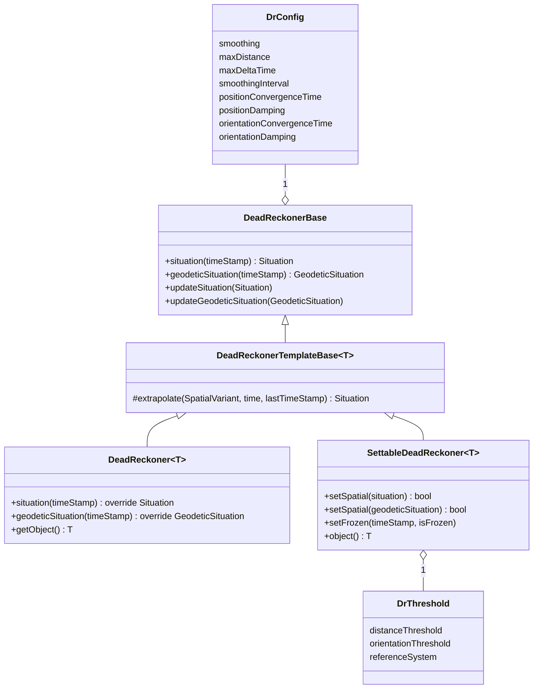
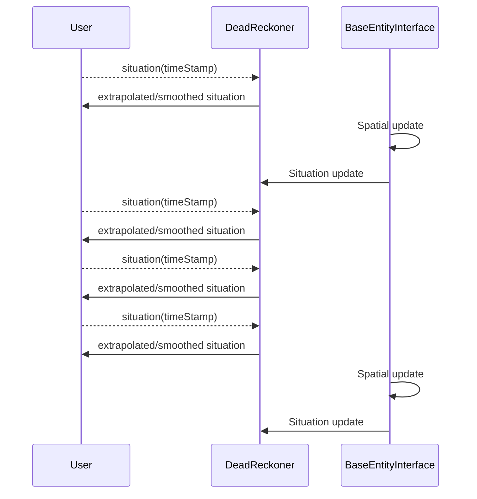
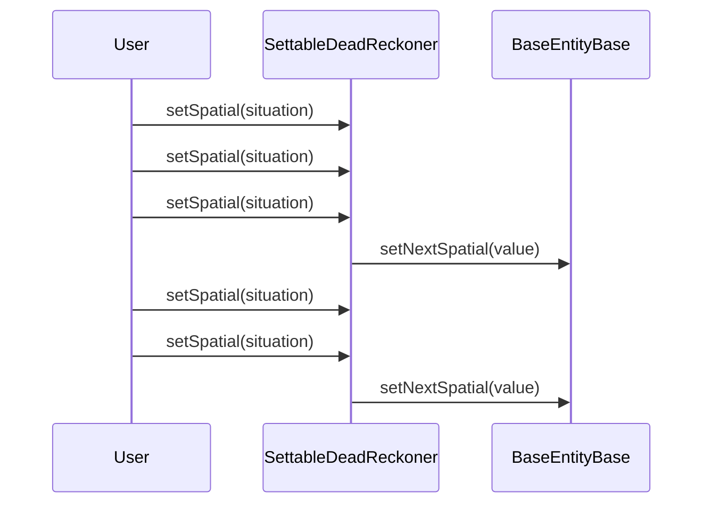

# sen::util

This library houses Sen tools that, while not part of the Sen core, are frequently used within Sen
environments.

This library currently contains only Dead Reckoning utilities.

Check out the [API Reference](../doxygen_gen/html/index.html) for a detailed description of the Sen
Util library.

## Dead Reckoning utilities

### What is it?

Dead Reckoning is a way to cut data transmission in distributed simulations and networked
applications. Instead of transmitting real time positions continuously, each participant predicts
where an entity has moved between infrequent state updates: it extrapolates the entity forward with
a kinematic model, from the last position, velocity and acceleration it received. Bandwidth drops,
and the entities still appear to be in step.

This library enables the computation of Dead Reckoning extrapolations on entities by using these two
APIs:

- The base API where a custom `Situation` struct is used for the extrapolation.
- An API adapted to RPR which takes a `BaseEntity` object instance and extrapolates its spatial
  situation following the algorithms specified in IEEE 1278.1-2012, Annex E.

Additionally, this library allows users to update `BaseEntity` object instances based on error
between real-time data and extrapolated values, thereby reducing spatial data transmission.

### How to use it?

Information on how to use the Dead Reckoning library can be found in this
[guide](../howto_guides/dead_reckoning.md).

### Detailed design

This section targets readers interested in the detailed design of the Dead Reckoning library.

#### Our main goals

The primary objectives that motivated the design of this library are as follows:

- **Coverage**: This library extrapolates position and orientation data for all the Dead Reckoning
  algorithms contemplated in the IEEE 1278.1-2012, Annex E.

- **Performance**: Dead Reckoning extrapolations are usually computed at a frequency higher than the
  network's frequency, thus making efficiency a key requirement of this library. All the algorithms
  were implemented paying attention to their computational performance, e.g., using quaternions
  instead of matrix multiplications for rotations.

- **User Friendly**: The API of the library was made as simple as possible for the user, only
  requiring the user to provide a simple Smoothing/Threshold configuration and a reference to the
  Sen object (local/remote).

- **A library, not a package**: This software is a Sen library, but it is not a package. This can be
  confusing because Sen packages are also .so files (shared library). Being a Sen library means that
  it provides a set of helpers which can be used by another package, but it cannot be instantiated
  directly by the Sen kernel.

A general diagram of the library is shown below:


```mermaid
classDiagram
    class DeadReckonerBase {
        +situation(timeStamp) Situation
        +geodeticSituation(timeStamp) GeodeticSituation
        +updateSituation(Situation)
        +updateGeodeticSituation(GeodeticSituation)
    }
    class DeadReckonerTemplateBase~T~ {
        #extrapolate(SpatialVariant, time, lastTimeStamp) Situation
    }
    class DeadReckoner~T~ {
        +situation(timeStamp) override Situation
        +geodeticSituation(timeStamp) override GeodeticSituation
        +getObject() T
    }
    class DrConfig {
        smoothing
        maxDistance
        maxDeltaTime
        smoothingInterval
        positionConvergenceTime
        positionDamping
        orientationConvergenceTime
        orientationDamping
    }
    class SettableDeadReckoner~T~ {
        +setSpatial(situation) bool
        +setSpatial(geodeticSituation) bool
        +setFrozen(timeStamp, isFrozen)
        +object() T
    }
    class DrThreshold {
        distanceThreshold
        orientationThreshold
        referenceSystem
    }
    DeadReckonerBase <|-- DeadReckonerTemplateBase~T~
    DeadReckonerTemplateBase~T~ <|-- DeadReckoner
    DeadReckonerTemplateBase~T~ <|-- SettableDeadReckoner
    DrConfig --o DeadReckonerBase : 1
    SettableDeadReckoner o-- DrThreshold : 1
```

The `DeadReckonerBase` class encapsulates the core functionality of the dead reckoning, and that
class can be directly used to extrapolate (and optionally smooth) any `Situation` that does not need
to be coming from the RPR `Spatial` attribute.

The `DeadReckonerTemplateBase<T>` class particularizes this functionality for RPR object instances
and the `DeadReckoner<T>` and `SettableDeadReckoner<T>` classes inherit from it.

#### Data models and configuration

The dead reckoning library extrapolates the position and orientation of an entity from a
*situation*. `Situation` and `GeodeticSituation` differ only in the frame the position and
orientation are expressed in: the first uses ECEF, the second latitude/longitude/altitude with
orientation relative to NED.

**`sen::util::Situation`**: Cartesian, earth-centered earth-fixed.

| Field | Components | Unit | Frame | Meaning |
|---|---|---|---|---|
| `isFrozen` | — | `bool` | — | When true no extrapolation is performed. Default `false` |
| `timeStamp` | — | `sen::TimeStamp` | — | The instant this situation describes |
| `worldLocation` | `x` `y` `z` | meters | ECEF | Position |
| `orientation` | `psi` `theta` `phi` | radians | body relative to ECEF | Body axes are x forward, y right, z down |
| `velocityVector` | `x` `y` `z` | m/s | ECEF *or* body | Depends on the algorithm being extrapolated |
| `angularVelocity` | `x` `y` `z` | rad/s | body | |
| `accelerationVector` | `x` `y` `z` | m/s² | ECEF *or* body | Depends on the algorithm being extrapolated |
| `angularAcceleration` | `x` `y` `z` | rad/s² | body | |

**`sen::util::GeodeticSituation`**: identical apart from the three rows below.

| Field | Components | Unit | Frame | Meaning |
|---|---|---|---|---|
| `worldLocation` | `latitude` `longitude` | degrees | — | `altitude` is in meters |
| `orientation` | `psi` `theta` `phi` | radians | body relative to NED | North-East-Down |
| `velocityVector`, `accelerationVector` | `x` `y` `z` | m/s, m/s² | NED | The overload converts these to ECEF before writing; see **Reference System** below |

**`sen::util::DrConfig`**: the smoothing configuration. The defaults are tuned to work in most
scenarios; [the how-to guide](../howto_guides/dead_reckoning.md) explains which way to turn each
one.

| Field | Type | Unit | Default | Meaning |
|---|---|---|---|---|
| `smoothing` | `bool` | — | `true` | Smooth incoming position and orientation to remove noise |
| `maxDistance` | `f64` | meters | `100000.0` | Displacements larger than this are not smoothed |
| `maxDeltaTime` | `sen::Duration` | — | `1 s` | Time deltas larger than this are not smoothed |
| `smoothingInterval` | `sen::Duration` | — | `20 ms` | Longest interval used to update the smoothed solution; caps it to keep the solution stable |
| `positionConvergenceTime` | `sen::Duration` | — | `500 ms` | How long the smoothed position takes to reach the updated position |
| `positionDamping` | `f64` | — | `1.0` | Damping of the smoothed position |
| `orientationConvergenceTime` | `sen::Duration` | — | `50 ms` | How long the smoothed orientation takes to reach the updated orientation |
| `orientationDamping` | `f64` | — | `20.0` | Damping of the smoothed orientation |

The lengths, angles and rates above are quantity types (`LengthMeters`, `AngleRadians`,
`VelocityMetersPerSecond` and so on), so the unit is part of the type rather than a convention you
have to remember.

In C++ a quantity is a wrapper over its underlying type that converts to and from it implicitly, so
you can pass one wherever the plain number is expected and assign a plain number back. The unit is
enforced where values cross between components, not inside arithmetic you write yourself.

??? note "C++ declarations"

    ```c++ title="sen::util::Situation"
    --8<-- "libs/util/include/sen/util/dr/algorithms.h:situation"
    ```

    ```c++ title="sen::util::GeodeticSituation"
    --8<-- "libs/util/include/sen/util/dr/algorithms.h:geodetic_situation"
    ```

    ```c++ title="sen::util::DrConfig"
    --8<-- "libs/util/include/sen/util/dr/algorithms.h:dr_config"
    ```

#### The Dead Reckoner Base

The `DeadReckonerBase` has the following API:

```c++ title="DeadReckonerBase API"
--8<-- "libs/util/include/sen/util/dr/detail/dead_reckoner_base.h:dead_reckoner_base"
```

Where the user needs to call `updateSituation` (with a situation containing a valid timestamp) every
time the last-known data can be updated. Calling `situation` or `geodeticSituation` retrieves the
position/orientation extrapolated to the timestamp provided as argument.

#### The Dead Reckoner

The `DeadReckoner<T>` provides an API to the user tailored to accept `rpr::BaseEntityInterface`
object instances and perform extrapolations on them following the algorithms specified in IEEE
1278.1-2012, Annex E. Their updates are detected automatically in this case. The API is shown below:

```c++ title="DeadReckoner API"
--8<-- "libs/util/include/sen/util/dr/dead_reckoner.h:dead_reckoner"
```

The following diagram shows how the dead reckoner performs extrapolations of the `rpr::BaseEntity`
object:


```mermaid
sequenceDiagram
    User-->>DeadReckoner: situation(timeStamp)
    DeadReckoner->>User: extrapolated/smoothed situation
    BaseEntityInterface->>BaseEntityInterface: Spatial update
    BaseEntityInterface->>DeadReckoner: Situation update
    User-->>DeadReckoner: situation(timeStamp)
    DeadReckoner->>User: extrapolated/smoothed situation
    User-->>DeadReckoner: situation(timeStamp)
    DeadReckoner->>User: extrapolated/smoothed situation
    User-->>DeadReckoner: situation(timeStamp)
    DeadReckoner->>User: extrapolated/smoothed situation
    BaseEntityInterface->>BaseEntityInterface: Spatial update
    BaseEntityInterface->>DeadReckoner: Situation update
```

#### The Settable Dead Reckoner

The main functionality of the `SettableDeadReckoner<T>` is to allow an application to write
`Spatial` data in a local object of type T (inheriting from `BaseEntityBase`) when the difference
between the extrapolation and the new `Spatial` updates is bigger than a configurable threshold.
This facilitates the reduction of the load in the Sen network, by only updating the object when
necessary.

The Settable Dead Reckoner takes the `DrThreshold` as a configuration. The definition of the
`DrThreshold` is shown below:

```cpp title="sen::util::DrThreshold"
--8<-- "libs/util/include/sen/util/dr/settable_dead_reckoner.h:dr_threshold"
```

Both thresholds default to a value that already suppresses most updates, one meter and 0.05 radians
(about 2.9 degrees), so the reduction in traffic happens without any configuration. Setting either
to zero has the opposite effect of what this class is for: every update would exceed it.

As you can see, it enables the configuration of the following parameters:

- **Distance Threshold**: Minimum distance in meters between the extrapolation and the new position
  updates (in any of the components of the position x, y or z) to trigger a set of the `Spatial`
  property of the local object. The distance threshold can be expressed with the following
  expressions, where $new$ indicates updates in the position and $dr$ extrapolated positions.

$$
\Delta x = |x_{new} - x_{dr}|
$$

$$
\Delta y = |y_{new} - y_{dr}|
$$

$$
\Delta z = |z_{new} - z_{dr}|
$$

- **Orientation Threshold**: Minimum angle in radians between the extrapolation and new orientation
  updates to trigger a set of the `Spatial` property of the local Sen object. The orientation
  threshold can be easily computed using quaternions with the following expressions, where $q_{new}$
  is the quaternion representing the new orientation update, $q_{dr}$ is the quaternion representing
  the extrapolated orientation and $\beta$ is the angle between both orientations:

$$
q_{new} \cdot q_{dr} = cos(\frac{\beta}{2})
$$

- **Reference System**: Reference system used for the `Spatial` property of the local
  `BaseEntityBase` object. Spatial dead reckoning algorithms use two different reference systems,
  body (x forward, y right, z down) and world (ECEF). This setting picks which of the two the
  written `Spatial` is tagged with, and it applies to both `setSpatial` overloads. The
  `GeodeticSituation` overload converts its position, orientation, velocity and acceleration to
  ECEF before writing them, so leaving this at its `world` default is what matches that data;
  setting it to `body` on that path produces a `Spatial` holding world vectors under a body-frame
  algorithm.

The two main methods of the `SettableDeadReckoner<T>` class are the two overloads of the
`setSpatial` method, which take a Situation and a GeodeticSituation as inputs. These two overloads
allow the consumer to input the `Situation` in two possible reference systems.

Both return `true` when the call published a new `Spatial` and `false` when the extrapolation was
still within the threshold, which is the common case for anything in near-linear motion. You can
ignore the return, and most callers do. It is there for a producer that needs to know whether it
wrote on this cycle: instrumentation that must not report activity on a cycle where the object
published nothing, for instance. Note that it reports what was **published**, not whether the
situation you passed in differed from the last one.

As you can see in the [algorithms annex](#dead-reckoning-algorithms), the `Spatial` property of a
`BaseEntity` can use multiple DeadReckoning algorithms. The `SettableDeadReckoner<T>` automatically
selects the algorithm that will be used by the `Spatial` dynamically depending on the data inputted
in the `Situation`, e.g, if an input situation's acceleration vector is null, a first order
extrapolation of the position will be chosen.


```mermaid
sequenceDiagram
    User->>SettableDeadReckoner: setSpatial(situation)
    User->>SettableDeadReckoner: setSpatial(situation)
    User->>SettableDeadReckoner: setSpatial(situation)
    SettableDeadReckoner->>BaseEntityBase: setNextSpatial(value)
    User->>SettableDeadReckoner: setSpatial(situation)
    User->>SettableDeadReckoner: setSpatial(situation)
    SettableDeadReckoner->>BaseEntityBase: setNextSpatial(value)
```

You can see the functionality of the `SettableDeadReckoner<T>` in the diagram above. The
setNextSpatial is only performed in the local Sen object (`rpr::BaseEntityBase`) when the threshold
of the difference between a local extrapolation and the new Spatial values is exceeded.

#### Smoothing

In applications where the smoothness of the spatial data is key, such as IGs, we recommend enabling
smoothing as the extrapolation by itself makes rough corrections every time new data is received
from the bus.

The smoothing algorithm simply filters all discontinuities in the input spatial data by holding an
internal smoothed situation that updates its acceleration depending on its total error with respect
to the input data. The following diagram depicts the smoothing of the x location. The same smoothing
algorithm is applied to both position and orientation:

{: style="width:700px"}
{: style="width:700px"}

Updating the acceleration helps to avoid discontinuities in the solution because we perform a second
order integration. The condition to update the acceleration is that the smoothed solution needs to
converge with the input data after a convergence time. This directly translates to higher
accelerations as the error increases. The smoothed solution can be unstable for small convergence
times, which is why the update is advanced in steps no longer than `smoothingInterval`, 20 ms by
default. The convergence time you configure is used as given.

In addition to the convergence time, a damping is applied to the smoothed solution to avoid
overshooting. This coefficient is configurable via `DrConfig`, and the defaults are tuned to
damp the position and orientation solutions well. Changing them is not recommended unless
you need to.

Finally, when the error between the smoothed solution and the input data surpasses a maximum
distance threshold (configurable in the DrConfig), the error is corrected instantly without
smoothing. This applies, for example, when the IOS applies big corrections to the location of the
entities.

#### Dead Reckoning algorithms

Here we detail the extrapolation algorithms implemented in this library. This library covers all the
algorithms specified on IEEE 1278.1-2012, Annex E.

**Static**: No movement.

$$
P = P_0
$$

**FPW**: Linear extrapolation of the position, not considering rotation and using the world
reference system.

$$
P = P_0 + V_0 \Delta t
$$

**RPW**: Linear extrapolation of the position, considering rotation and using the world reference
system.

$$
P = P_0 + V_0 \Delta t
$$

$$
[R] _{\omega -> B} = [DR] [R_0] _ {\omega -> B }
$$

**RVW**: Second order extrapolation of the position, considering rotation and using the world
reference system.

$$
P = P_0 + V_0 \Delta t + 1/2 A_0 \Delta t^2
$$

$$
[R] _{\omega -> B} = [DR] [R_0] _ {\omega -> B }
$$

**FVW**: Second order extrapolation of the position, not considering rotation and using the world
reference system.

$$
P = P_0 + V_0 \Delta t + 1/2 A_0 \Delta t^2
$$

**FPB**: First order extrapolation of the position, not considering rotation and using the body
reference system.

$$
P = P_0 + [R] ^ {-1}_ {\omega -> B } [R1]V_b
$$

**RPB**: First order extrapolation of the position, considering rotation and using the body
reference system.

$$
P = P_0 + [R] ^ {-1}_ {\omega -> B } [R1]V_b
$$

$$
[R] _{\omega -> B} = [DR] [R_0] _ {\omega -> B }
$$

**RVB**: Second order extrapolation of the position, considering rotation and using the body
reference system.

$$
P = P_0 + [R] ^ {-1}_ {\omega -> B } ([R1]V_b + [R2]A_b)
$$

$$
[R] _{\omega -> B} = [DR] [R_0] _ {\omega -> B }
$$

**FVB**: Second order extrapolation of the position, not considering rotation and using the body
reference system.

$$
P = P_0 + [R] ^ {-1}_ {\omega -> B } ([R1]V_b + [R2]A_b)
$$
