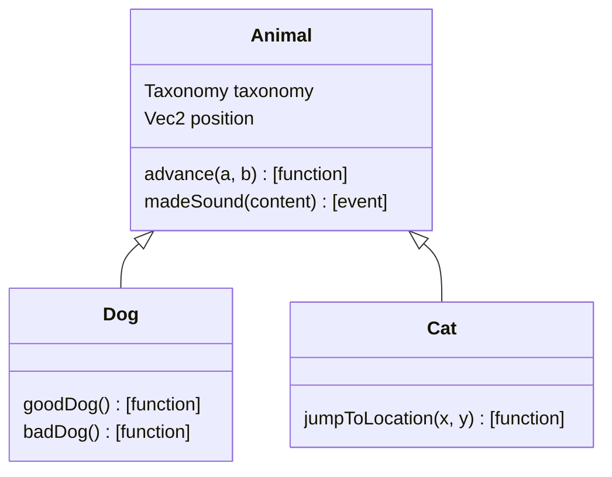

# Inheritance example

This example shows how inheritance works in Sen.

## Interface

There's a base class defined in `animal.stl` from which we have two subclasses in `cat.stl` and
`dog.stl`.



=== "_animal.stl_"

    ```rust
    --8<-- "snippets/examples/packages/animals/stl/animal.stl"
    ```

=== "_cat.stl_"

    ```rust
    --8<-- "snippets/examples/packages/animals/stl/cat.stl"
    ```

=== "_dog.stl_"

    ```rust
    --8<-- "snippets/examples/packages/animals/stl/dog.stl"
    ```

## Implementation

We provide an implementation of `Animal`, and reference it in the implementations of `Cat` and `Dog`
using template parameters. With this mechanism, you can "inject" implementations in intermediate
classes of a class hierarchy.

=== "_animal.h_"

    ```c++
    --8<-- "snippets/examples/packages/animals/src/animal.h"
    ```

=== "_cat_impl.cpp_"

    ```c++
    --8<-- "snippets/examples/packages/animals/src/cat_impl.cpp"
    ```

=== "_dog_impl.cpp_"

    ```c++
    --8<-- "snippets/examples/packages/animals/src/dog_impl.cpp"
    ```

## How to run it

Let's define what we want to run in our Sen kernel.

```yaml title="Configuration file"
--8<-- "snippets/examples/config/2_inheritance/1_inheritance.yaml"
```

To run it, let's call `sen run`:

```
sen run config/2_inheritance/1_inheritance.yaml
```

This will open a shell and tell Sen to instantiate the cat and dog implementations in the
`my.tutorial` bus.

You can interact with the objects by doing commands such as:

```
info my.tutorial.elon.print
info my.tutorial.rufus.print

info my.tutorial.elon.advance 2, 2
info my.tutorial.elon.getPosition
info my.tutorial.elon.goodDog

info my.tutorial.rufus.advance 2, 2
info my.tutorial.rufus.getPosition
info my.tutorial.rufus.jumpToPosition 4, 4
info my.tutorial.rufus.getPosition
```

## Running it over the network

We can run it over the network using the eth component. This is the same as the first example, but
you will need to start two processes.

First run:

```
sen run config/2_inheritance/2_inheritance_eth.yaml
```

Then, in another terminal or command prompt, run:

```
sen shell
```

In this new Sen instance, open the bus where we should find our objects:

```
open my.tutorial
```

You should be able to work with the objects as if you were on the same process.

## Using the explorer

You can also run it using the explorer to see and interact with the objects in a more graphical way.

```
sen run config/2_inheritance/2_inheritance_exp.yaml
```

You can monitor the events produced by the instances by opening the relevant window, checking the
relevant events, and looking at the event explorer window. For example, if you monitor the dog, you
should be able to see events when calling the goodDog and badDog function. Same when calling the
jumpToLocation on the cat.
